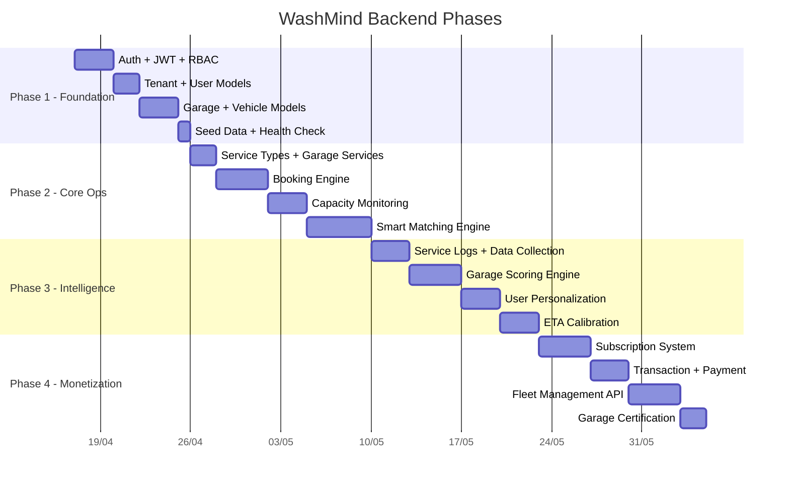
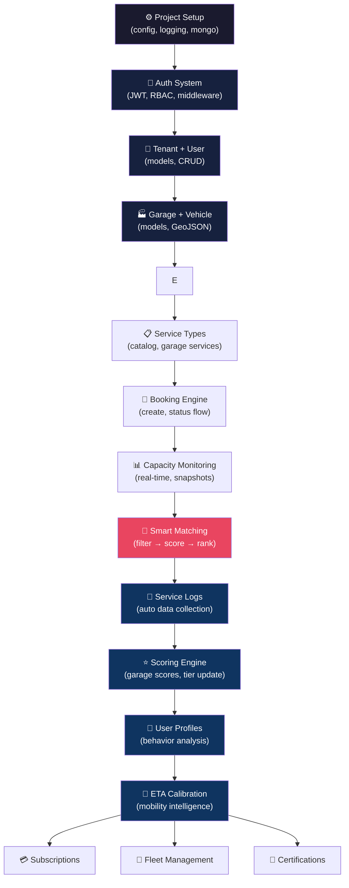

# WashMind Backend — Building Plan

> **Stack**: FastAPI + MongoDB (Motor + Umongo) + UV + Docker
> **Pattern**: Feature-First Architecture + TenantAwareDocument (multi-tenant)
> **Ngày tạo**: 17/04/2026

---

## Quyết Định Kiến Trúc Quan Trọng

### Multi-Tenancy cho SaaS Platform

WashMind có bài toán đặc biệt: **vừa cần tenant isolation, vừa cần cross-tenant querying**.

- Mỗi gara = 1 tenant → gara chỉ thấy data của mình (staff, doanh thu, operations)
- Matching Engine phải query **xuyên suốt tất cả gara** → cần dữ liệu platform-level

**Giải pháp: Hybrid Tenant Model**

```
┌─────────────────────────────────────────────────────────┐
│                    PLATFORM LEVEL                       │
│  (super_admin hoặc system service truy cập)            │
│                                                         │
│  • garages (public profiles, location, tier)            │
│  • bookings (cross-tenant: user ↔ garage)               │
│  • service_logs (data moat — cross-tenant analytics)    │
│  • search_logs, eta_logs (demand intelligence)          │
│  • subscriptions, transactions (platform financials)    │
├─────────────────────────────────────────────────────────┤
│                    TENANT LEVEL                          │
│  (mỗi gara chỉ thấy data của mình)                    │
│                                                         │
│  • garage_settings (cấu hình riêng)                    │
│  • garage_staff (nhân viên)                             │
│  • garage_service_slots (bay rửa xe, lịch hoạt động)   │
│  • garage_inventory (hóa chất, vật tư)                 │
└─────────────────────────────────────────────────────────┘
```

**Cách implement**: Tất cả collections đều dùng `TenantAwareDocument` (có `tenant_id`). Khác biệt nằm ở **ai query**:
- Garage owner query → auto-filter theo `tenant_id` của họ
- Matching Engine / Platform service query → dùng `current_user={"tenant_id": "super_admin"}` để bypass tenant filter
- Customer query bookings → filter theo `customer_id` (không phải tenant)

### User Roles Trong Hệ Thống

| Role | Scope | Mô tả |
|---|---|---|
| `super_admin` | Platform | WashMind team — quản lý toàn bộ platform |
| `platform_ops` | Platform | Nhân viên vận hành WashMind |
| `garage_owner` | Tenant | Chủ gara — admin của tenant |
| `garage_manager` | Tenant | Quản lý gara — quyền hạn hẹp hơn owner |
| `garage_staff` | Tenant | Nhân viên gara — check-in/check-out xe |
| `customer` | Cross-tenant | Khách hàng — không thuộc tenant cụ thể |
| `fleet_manager` | Cross-tenant | Quản lý đội xe doanh nghiệp |

> [!IMPORTANT]
> **Customer không phải tenant member.** Customer là entity riêng, tương tác với nhiều garage. Khi query bookings cho customer → filter theo `customer_id`, KHÔNG filter theo `tenant_id`.

---

## Tổng Quan 4 Phase



---

## Phase 1 — Foundation (Auth + Multi-tenant + Core Models)

> **Mục tiêu**: Backend chạy được, login/register, tạo tenant, CRUD garage & vehicle.
> **Ưu tiên**: 🔴 BẮT BUỘC hoàn thành trước khi làm gì khác.

### 1.1. Project Setup

```
washmind/backend/
├── main.py                         # FastAPI entry point
├── pyproject.toml                  # uv dependencies
├── .env                            # Environment variables
├── app/
│   ├── core/
│   │   ├── config.py               # pydantic-settings
│   │   └── logging_config.py       # Logging setup
│   ├── db/
│   │   ├── mongo.py                # Motor + Umongo singleton
│   │   └── base_model.py           # TenantAwareDocument
│   ├── api/
│   │   ├── main_router.py          # Router aggregation
│   │   ├── auth/                   # JWT + RBAC
│   │   │   ├── auth_schemas.py
│   │   │   ├── auth_utils.py
│   │   │   ├── auth_views.py
│   │   │   ├── jwt_manager.py
│   │   │   ├── dependencies.py
│   │   │   └── permissions.py
│   │   ├── tenant/                 # Tenant management
│   │   │   ├── tenant_models.py
│   │   │   ├── tenant_schemas.py
│   │   │   ├── tenant_utils.py
│   │   │   └── tenant_views.py
│   │   ├── user/                   # User management
│   │   │   ├── user_models.py
│   │   │   ├── user_schemas.py
│   │   │   ├── user_utils.py
│   │   │   └── user_views.py
│   │   ├── garage/                 # Garage profiles
│   │   │   ├── garage_models.py
│   │   │   ├── garage_schemas.py
│   │   │   ├── garage_utils.py
│   │   │   └── garage_views.py
│   │   ├── vehicle/                # User vehicles
│   │   │   ├── vehicle_models.py
│   │   │   ├── vehicle_schemas.py
│   │   │   ├── vehicle_utils.py
│   │   │   └── vehicle_views.py
│   │   └── shared/
│   │       ├── common_utils.py
│   │       ├── schemas.py
│   │       ├── exceptions.py
│   │       └── tool/
│   │           ├── convert_object_id.py
│   │           └── datetime_convert.py
│   └── services/
│       └── shared/
│           └── redis_client.py     # (placeholder, dùng sau)
```

### 1.2. MongoDB Collections — Phase 1
Lưu ý các collection phải có tenant_id
#### Collection: `tenants`

```javascript
{
  _id: ObjectId,
  name: "AutoSpa Quận 3",           // Tên tenant (garage hoặc chain)
  slug: "autospa-q3",               // URL-friendly identifier
  type: "garage",                    // "garage" | "chain" | "platform"
  status: "active",                  // "pending" | "active" | "suspended" | "terminated"
  owner_user_id: ObjectId,          // Ref → users
  contact: {
    phone: "0901234567",
    email: "autospa@mail.com",
    address: "123 Nguyễn Huệ, Q3"
  },
  subscription_plan: "free",        // "free" | "basic" | "pro" | "enterprise"
  settings: {
    timezone: "Asia/Ho_Chi_Minh",
    currency: "VND",
    language: "vi"
  },
  created_at: ISODate,
  updated_at: ISODate,
  created_by: "system"
}
// Indexes: { slug: 1 } unique, { status: 1 }, { owner_user_id: 1 }
```

#### Collection: `users`

```javascript
{
  _id: ObjectId,
  tenant_id: "autospa-q3",           // Tenant sở hữu (null cho customer)
  username: "nguyenvana",
  email: "a@mail.com",
  phone: "0901234567",
  password_hash: "$2b$...",
  name: "Nguyễn Văn A",
  role: "garage_owner",              // Enum role
  is_active: true,
  
  // Chỉ có ở customer
  customer_profile: {
    vetc_id: "VETC_12345",           // Liên kết VETC (giai đoạn sau)
    default_vehicle_id: ObjectId,
    preferred_tier: "pro",
    home_location: { type: "Point", coordinates: [106.69, 10.77] },
    work_location: { type: "Point", coordinates: [106.70, 10.78] }
  },
  
  // Chỉ có ở garage staff
  staff_profile: {
    position: "washer",              // "washer" | "cashier" | "manager"
    shift: "morning"                 // "morning" | "afternoon" | "full"
  },
  
  allowed_tenant_ids: null,          // Cho center manager quản lý chuỗi
  last_login: ISODate,
  created_at: ISODate,
  updated_at: ISODate
}
// Indexes: { username: 1 } unique, { email: 1 } unique, { phone: 1 },
//          { tenant_id: 1, role: 1 }, { "customer_profile.vetc_id": 1 }
```

#### Collection: `roles`

```javascript
{
  _id: ObjectId,
  tenant_id: "autospa-q3",          // "super_admin" cho platform roles
  name: "Quản lý gara",
  code: "garage_manager",
  permissions: [
    "garage:view", "garage:edit",
    "booking:view", "booking:create", "booking:edit",
    "staff:view",
    "report:view"
  ],
  is_system: false,                  // true = không xóa được
  created_at: ISODate,
  updated_at: ISODate
}
// Indexes: { tenant_id: 1, code: 1 } unique
```

#### Collection: `garages`

```javascript
{
  _id: ObjectId,
  tenant_id: "autospa-q3",           // 1 tenant = 1 garage (hoặc nhiều nếu chain)
  name: "AutoSpa Quận 3",
  slug: "autospa-q3",

  // ── Location (GeoJSON — critical cho matching) ──
  location: {
    type: "Point",
    coordinates: [106.6856, 10.7834]  // [lng, lat]
  },
  address: {
    street: "123 Nguyễn Huệ",
    ward: "Phường Bến Nghé",
    district: "Quận 3",
    city: "TP Hồ Chí Minh",
    province: "HCM"
  },

  // ── Tiering ──
  tier: 2,                            // 1=Basic, 2=Standard, 3=Pro, 4=Elite
  tier_score: 58.5,                   // Score tổng hợp (0-100)
  tier_assessment: {
    equipment_score: 60,
    process_score: 55,
    staff_score: 50,
    capacity_score: 70,
    reliability_score: 48,
    last_assessed_at: ISODate,
    assessed_by: "system"
  },

  // ── Capacity ──
  capacity: {
    total_bays: 3,                    // Số bay (vị trí rửa xe)
    max_vehicles_per_hour: 6,         // Công suất tối đa
    avg_processing_time_minutes: 25,  // Thời gian xử lý TB (phút)
    operating_hours: {
      monday:    { open: "07:00", close: "20:00" },
      tuesday:   { open: "07:00", close: "20:00" },
      wednesday: { open: "07:00", close: "20:00" },
      thursday:  { open: "07:00", close: "20:00" },
      friday:    { open: "07:00", close: "21:00" },
      saturday:  { open: "07:00", close: "21:00" },
      sunday:    { open: "08:00", close: "18:00" }
    }
  },

  // ── Business info ──
  services_offered: ["wash_basic", "wash_premium", "detailing", "interior"],
  vehicle_types_accepted: ["sedan", "suv", "luxury"],  // Mapping từ tier
  amenities: ["wifi", "waiting_area", "coffee"],
  photos: ["url1", "url2"],

  // ── Status ──
  status: "active",                   // "pending_review" | "active" | "suspended"
  is_verified: true,
  is_accepting_bookings: true,

  // ── Real-time (updated frequently) ──
  current_load: {
    vehicles_in_service: 2,
    vehicles_waiting: 1,
    estimated_wait_minutes: 15,
    last_updated: ISODate
  },

  // ── Aggregate scores (updated periodically) ──
  stats: {
    total_services: 1250,
    avg_rating: 4.3,
    retention_rate: 0.65,             // 65% khách quay lại
    complaint_rate: 0.02,             // 2%
    avg_actual_processing_minutes: 27,
    on_time_rate: 0.88                // 88% đúng giờ
  },

  created_at: ISODate,
  updated_at: ISODate
}
// Indexes: { location: "2dsphere" }, { tenant_id: 1 },
//          { tier: 1, status: 1 }, { "address.district": 1, "address.city": 1 },
//          { status: 1, is_accepting_bookings: 1 }
```

#### Collection: `vehicles`

```javascript
{
  _id: ObjectId,
  tenant_id: "platform",             // Platform-level entity
  owner_user_id: ObjectId,           // Ref → users
  
  // ── Vehicle info ──
  license_plate: "51A-12345",
  brand: "Mercedes-Benz",
  model: "S-Class",
  year: 2023,
  color: "Black",
  
  // ── Classification (auto hoặc manual) ──
  vehicle_type: "luxury",            // "standard" | "premium" | "luxury" | "super"
  body_type: "sedan",                // "sedan" | "suv" | "hatchback" | "truck" | "van"
  size_class: "large",               // "compact" | "medium" | "large" | "xl"
  
  // ── Mapping tier yêu cầu ──
  minimum_garage_tier: 3,            // Xe luxury cần ít nhất Tier 3
  
  // ── VETC integration (Phase sau) ──
  vetc_vehicle_id: null,
  vetc_linked: false,
  
  is_default: true,                  // Xe mặc định của user
  is_active: true,
  
  created_at: ISODate,
  updated_at: ISODate
}
// Indexes: { owner_user_id: 1 }, { license_plate: 1 } unique,
//          { vehicle_type: 1 }
```

### 1.3. Auth Endpoints — Phase 1

| Method | Path | Mô tả | Public? |
|---|---|---|---|
| `POST` | `/auth/register` | Đăng ký customer | ✅ |
| `POST` | `/auth/login` | Đăng nhập (JWT cookie) | ✅ |
| `POST` | `/auth/refresh` | Refresh access token | ✅ |
| `POST` | `/auth/logout` | Xóa cookies | ✅ |
| `GET`  | `/auth/me` | Thông tin user hiện tại | 🔒 |
| `POST` | `/auth/register-garage` | Đăng ký gara mới (tạo tenant + user) | ✅ |

### 1.4. API Endpoints — Phase 1

| Method | Path | Permission | Mô tả |
|---|---|---|---|
| **Tenant** | | | |
| `GET` | `/tenants` | `tenant:view` | List tenants (admin) |
| `GET` | `/tenants/{id}` | `tenant:view` | Chi tiết tenant |
| `PUT` | `/tenants/{id}` | `tenant:edit` | Cập nhật tenant |
| **User** | | | |
| `GET` | `/users` | `user:view` | List users trong tenant |
| `POST` | `/users` | `user:create` | Tạo user (staff) |
| `PUT` | `/users/{id}` | `user:edit` | Cập nhật user |
| `DELETE` | `/users/{id}` | `user:delete` | Vô hiệu hóa user |
| **Garage** | | | |
| `GET` | `/garages` | Public | List garages (cho customer tìm kiếm) |
| `GET` | `/garages/{id}` | Public | Chi tiết garage |
| `POST` | `/garages` | `garage:create` | Tạo garage profile |
| `PUT` | `/garages/{id}` | `garage:edit` | Cập nhật garage |
| `PUT` | `/garages/{id}/status` | `garage:edit` | Update real-time load |
| **Vehicle** | | | |
| `GET` | `/vehicles` | Auth required | List vehicles của user |
| `POST` | `/vehicles` | Auth required | Thêm xe |
| `PUT` | `/vehicles/{id}` | Auth required | Cập nhật xe |
| `DELETE` | `/vehicles/{id}` | Auth required | Xóa xe |

---

## Phase 2 — Core Operations (Booking + Matching + Capacity)

> **Mục tiêu**: User có thể tìm gara, đặt lịch, gara theo dõi được capacity.
> **Đây là MVP.** Matching Engine là trái tim.

### 2.1. MongoDB Collections — Phase 2

#### Collection: `service_types` (Platform-level catalog)

```javascript
{
  _id: ObjectId,
  tenant_id: "platform",
  code: "wash_premium",
  name: "Rửa xe Premium",
  category: "wash",                   // "wash" | "detailing" | "interior" | "coating"
  description: "Rửa ngoại thất + nội thất cơ bản",
  base_price_range: { min: 80000, max: 200000 },
  estimated_duration_minutes: 30,
  
  // Yêu cầu tối thiểu
  minimum_tier: 2,
  vehicle_type_multiplier: {          // Hệ số theo loại xe
    "standard": 1.0,
    "premium": 1.3,
    "luxury": 1.6,
    "super": 2.0
  },
  
  is_active: true,
  created_at: ISODate
}
```

#### Collection: `garage_services` (Tenant-level — dịch vụ gara cung cấp)

```javascript
{
  _id: ObjectId,
  tenant_id: "autospa-q3",
  garage_id: ObjectId,
  service_type_code: "wash_premium",
  
  // Override giá & thời gian cho gara cụ thể
  price: 150000,                      // Giá gara tự set
  estimated_duration_minutes: 25,     // Override từ service_type
  
  is_available: true,
  created_at: ISODate,
  updated_at: ISODate
}
// Indexes: { tenant_id: 1, garage_id: 1, service_type_code: 1 } unique
```

#### Collection: `bookings`

```javascript
{
  _id: ObjectId,
  tenant_id: "autospa-q3",            // Tenant = garage nhận booking
  booking_code: "WM-20260417-0042",   // Human-readable code
  
  // ── Parties ──
  customer_id: ObjectId,              // Ref → users (customer)
  garage_id: ObjectId,                // Ref → garages
  vehicle_id: ObjectId,               // Ref → vehicles
  
  // ── Service ──
  service_type_code: "wash_premium",
  price: 150000,
  
  // ── Timing ──
  requested_time: ISODate,            // Thời gian customer muốn
  estimated_arrival: ISODate,         // ETA khi đặt
  
  // ── Status flow ──
  status: "confirmed",
  // "pending" → "confirmed" → "customer_arriving" → "in_service" → "completed"
  //                         → "cancelled_by_customer" | "cancelled_by_garage" | "no_show"
  
  // ── Timestamps (DATA MOAT: Behavioral Truth) ──
  timestamps: {
    created_at: ISODate,              // Thời điểm đặt lịch
    confirmed_at: ISODate,            // Gara xác nhận
    customer_departed_at: ISODate,    // Customer bấm "Đang đến"
    customer_arrived_at: ISODate,     // Check-in (QR/GPS)
    service_started_at: ISODate,      // Gara bắt đầu rửa
    service_completed_at: ISODate,    // Gara hoàn thành
    customer_confirmed_at: ISODate,   // Customer xác nhận nhận xe
    cancelled_at: ISODate
  },
  
  // ── Matching context (lưu lại để phân tích) ──
  matching_context: {
    user_location_at_search: { type: "Point", coordinates: [106.69, 10.77] },
    estimated_travel_minutes: 15,
    actual_travel_minutes: null,      // Filled sau khi arrived
    match_score: 87.5,
    alternatives_shown: 3,            // Bao nhiêu gara khác được hiển thị
    was_top_recommendation: true      // User chọn top 1 hay không
  },
  
  // ── Feedback ──
  feedback: {
    rating: null,                     // 1-5 (sau khi completed)
    quick_feedback: null,             // "thumbs_up" | "thumbs_down"
    comment: null
  },
  
  cancellation_reason: null,
  created_at: ISODate,
  updated_at: ISODate
}
// Indexes: { customer_id: 1, status: 1 }, { garage_id: 1, status: 1 },
//          { tenant_id: 1, status: 1, requested_time: 1 },
//          { booking_code: 1 } unique, { created_at: -1 }
```

#### Collection: `capacity_snapshots` (Time-series tracking)

```javascript
{
  _id: ObjectId,
  tenant_id: "autospa-q3",
  garage_id: ObjectId,
  
  timestamp: ISODate,                 // Snapshot time (mỗi 5-10 phút)
  
  vehicles_in_service: 2,
  vehicles_waiting: 1,
  available_bays: 1,
  estimated_wait_minutes: 12,
  staff_on_duty: 3,
  
  // Aggregated
  hour_of_day: 14,                    // 0-23
  day_of_week: 4,                     // 0=Mon, 6=Sun
  
  created_at: ISODate
}
// Indexes: { garage_id: 1, timestamp: -1 },
//          { garage_id: 1, hour_of_day: 1, day_of_week: 1 }
// TTL Index: { created_at: 1 }, expireAfterSeconds: 90 * 86400 (90 ngày)
```

### 2.2. Smart Matching Engine — Core Algorithm

```python
"""
Matching Engine — Pseudo-code

Input:  user_location, vehicle_type, requested_time, preferences
Output: Top 3 garages ranked by match_score
"""

async def find_best_garages(request: MatchRequest) -> List[MatchResult]:
    # Step 1: Filter — Loại bỏ gara không đủ điều kiện
    candidates = await filter_garages(
        location=request.user_location,
        max_distance_km=15,               # Bán kính tìm kiếm
        min_tier=request.vehicle.minimum_garage_tier,
        status="active",
        is_accepting_bookings=True,
        has_service=request.service_type_code,
    )
    
    # Step 2: Enrich — Tính toán cho từng candidate
    for garage in candidates:
        # 2a. Distance + ETA (GoongIO Maps API)
        garage.travel_info = await get_travel_info(
            origin=request.user_location,
            destination=garage.location,
        )
        
        # 2b. Predicted state AT ARRIVAL TIME
        arrival_time = now() + garage.travel_info.duration
        garage.predicted_state = await predict_capacity(
            garage_id=garage.id,
            at_time=arrival_time,
        )
        
        # 2c. Calculate sub-scores
        garage.distance_score = calc_distance_score(garage.travel_info)
        garage.wait_score = calc_wait_score(garage.predicted_state)
        garage.quality_score = calc_quality_score(garage.tier_score, garage.stats)
        garage.fit_score = calc_vehicle_fit_score(garage.tier, request.vehicle)
    
    # Step 3: Rank — Match Score tổng hợp
    for garage in candidates:
        garage.match_score = (
            WEIGHT_DISTANCE * garage.distance_score +
            WEIGHT_WAIT     * garage.wait_score +
            WEIGHT_QUALITY  * garage.quality_score +
            WEIGHT_FIT      * garage.fit_score
        )
    
    # Step 4: Return top 3
    ranked = sorted(candidates, key=lambda g: g.match_score, reverse=True)
    return ranked[:3]
```

### 2.3. API Endpoints — Phase 2

| Method | Path | Permission | Mô tả |
|---|---|---|---|
| **Matching** | | | |
| `POST` | `/match/search` | Auth (customer) | Tìm gara phù hợp (core!) |
| `GET`  | `/match/nearby` | Public | Gara gần vị trí (simple) |
| **Booking** | | | |
| `POST` | `/bookings` | Auth (customer) | Đặt lịch |
| `GET`  | `/bookings` | Auth | List bookings (filtered by role) |
| `GET`  | `/bookings/{id}` | Auth | Chi tiết booking |
| `PUT`  | `/bookings/{id}/status` | Auth | Update status (check-in, start, complete) |
| `POST` | `/bookings/{id}/cancel` | Auth | Hủy booking |
| `POST` | `/bookings/{id}/feedback` | Auth (customer) | Gửi feedback |
| **Capacity** | | | |
| `GET`  | `/garages/{id}/capacity` | Public | Real-time capacity |
| `PUT`  | `/garages/{id}/capacity` | `garage:edit` | Update capacity (staff) |
| **Service Types** | | | |
| `GET`  | `/service-types` | Public | List dịch vụ |
| `GET`  | `/garages/{id}/services` | Public | Dịch vụ gara cung cấp |
| `POST` | `/garages/{id}/services` | `garage:edit` | Thêm dịch vụ cho gara |

---

## Phase 3 — Intelligence Layer (Data Moat + Scoring)

> **Mục tiêu**: Thu thập data moat tự động, build scoring engine, cá nhân hóa.
> **Đây là lợi thế cạnh tranh.** Code copy được, data không.

### 3.1. MongoDB Collections — Phase 3

#### Collection: `service_logs` (DATA MOAT — 🧠 Behavioral Truth + 🏭 Garage DNA)

```javascript
{
  _id: ObjectId,
  tenant_id: "autospa-q3",
  booking_id: ObjectId,
  garage_id: ObjectId,
  customer_id: ObjectId,
  vehicle_id: ObjectId,
  
  // ── Service details ──
  service_type_code: "wash_premium",
  vehicle_type: "luxury",
  body_type: "sedan",
  
  // ── Time measurements (Behavioral Truth) ──
  timing: {
    // Booking
    booking_to_arrival_minutes: 22,    // Từ đặt đến check-in
    estimated_travel_minutes: 15,      // ETA dự đoán
    actual_travel_minutes: 18,         // Thực tế
    
    // Service
    wait_time_minutes: 7,              // Chờ sau check-in
    processing_time_minutes: 28,       // Thời gian rửa thực tế
    total_visit_minutes: 35,           // Tổng thời gian tại gara
    
    // Punctuality
    customer_early_late_minutes: -2,   // Âm = sớm, Dương = trễ
  },
  
  // ── Context ──
  context: {
    hour_of_day: 17,
    day_of_week: 5,                    // Friday
    is_weekend: false,
    is_peak_hour: true,
    weather: "clear",                  // (nếu có API thời tiết)
    staff_count_at_time: 3
  },
  
  // ── Outcome ──
  outcome: {
    completed: true,
    customer_satisfaction: "thumbs_up",
    price_paid: 150000,
    tip_amount: 0
  },
  
  created_at: ISODate
}
// Indexes: { garage_id: 1, created_at: -1 },
//          { customer_id: 1, created_at: -1 },
//          { garage_id: 1, "context.hour_of_day": 1, "context.day_of_week": 1 },
//          { "timing.actual_travel_minutes": 1 }
```

#### Collection: `garage_scores` (📊 Continuous Scoring)

```javascript
{
  _id: ObjectId,
  tenant_id: "autospa-q3",
  garage_id: ObjectId,
  
  // ── Period ──
  period_type: "weekly",              // "daily" | "weekly" | "monthly"
  period_start: ISODate,
  period_end: ISODate,
  
  // ── Component scores (0-100) ──
  scores: {
    equipment: 60,
    process: 72,                       // Calculated from actual vs estimated time
    staff: 55,
    capacity_utilization: 68,
    reliability: 75                    // Retention + complaint rate
  },
  
  // ── Aggregate score ──
  total_score: 66.2,
  tier_recommendation: 2,             // Suggested tier from score
  
  // ── Raw metrics ──
  metrics: {
    total_services: 85,
    avg_processing_minutes: 27,
    on_time_rate: 0.88,
    retention_rate: 0.65,
    complaint_rate: 0.02,
    cancellation_rate: 0.05,
    avg_wait_minutes: 8,
    peak_utilization: 0.92,
    off_peak_utilization: 0.45
  },
  
  created_at: ISODate
}
// Indexes: { garage_id: 1, period_type: 1, period_start: -1 }
```

#### Collection: `search_logs` (📍 Mobility Intelligence — Demand Signals)

```javascript
{
  _id: ObjectId,
  tenant_id: "platform",
  customer_id: ObjectId,              // Nullable (anonymous search)
  session_id: "sess_abc123",
  
  // ── Search input ──
  search_location: { type: "Point", coordinates: [106.69, 10.77] },
  vehicle_type: "luxury",
  service_type_code: "wash_premium",
  requested_time: ISODate,
  
  // ── Results ──
  results_count: 5,
  results_shown: [                    // Top garages shown
    { garage_id: ObjectId, match_score: 92, rank: 1 },
    { garage_id: ObjectId, match_score: 85, rank: 2 },
    { garage_id: ObjectId, match_score: 78, rank: 3 }
  ],
  
  // ── User action (DATA MOAT: implicit feedback) ──
  action: "booked",                   // "booked" | "viewed_details" | "abandoned"
  selected_garage_id: ObjectId,       // Null nếu abandoned
  selected_rank: 1,                   // User chọn gara rank mấy
  time_spent_seconds: 45,             // Thời gian xem kết quả
  
  // ── Context ──
  context: {
    hour_of_day: 17,
    day_of_week: 5,
    district: "Quận 3",
    city: "HCM"
  },
  
  created_at: ISODate
}
// Indexes: { created_at: -1 }, { customer_id: 1, created_at: -1 },
//          { search_location: "2dsphere" },
//          { "context.district": 1, "context.hour_of_day": 1 }
// TTL: 180 days
```

#### Collection: `user_behavior_profiles` (👤 User Personalization Graph)

```javascript
{
  _id: ObjectId,
  tenant_id: "platform",
  customer_id: ObjectId,              // 1:1 với user
  
  // ── Computed behavior (auto-updated) ──
  wash_frequency: {
    per_month: 3.2,
    preferred_day_of_week: [5, 6],    // Fri, Sat
    preferred_hour: [14, 15, 16],     // Chiều
    last_wash_date: ISODate
  },
  
  // ── Location patterns ──
  frequent_areas: [
    { district: "Quận 3", city: "HCM", frequency: 0.60 },
    { district: "Quận 7", city: "HCM", frequency: 0.25 },
    { district: "Thủ Đức", city: "HCM", frequency: 0.15 }
  ],
  
  // ── Preference signals ──
  preferences: {
    price_sensitivity: "low",         // "low" | "medium" | "high"
    quality_preference: "high",       // Thường chọn tier cao
    distance_tolerance_km: 8,         // Chấp nhận đi xa bao nhiêu
    wait_tolerance_minutes: 15        // Chấp nhận chờ bao lâu
  },
  
  // ── Loyalty ──
  garage_affinity: [                  // Gara hay quay lại
    { garage_id: ObjectId, visit_count: 12, last_visit: ISODate, affinity: 0.60 },
    { garage_id: ObjectId, visit_count: 5, last_visit: ISODate, affinity: 0.25 }
  ],
  
  // ── Punctuality ──
  punctuality: {
    avg_early_late_minutes: -8,       // Thường đến sớm 8 phút
    on_time_rate: 0.75
  },
  
  total_bookings: 24,
  total_completed: 22,
  total_cancelled: 2,
  
  updated_at: ISODate
}
// Indexes: { customer_id: 1 } unique
```

### 3.2. API Endpoints — Phase 3

| Method | Path | Permission | Mô tả |
|---|---|---|---|
| **Analytics (Garage)** | | | |
| `GET` | `/garages/{id}/analytics` | `garage:view` | Dashboard analytics cho gara |
| `GET` | `/garages/{id}/scores` | `garage:view` | Score history |
| `GET` | `/garages/{id}/peak-hours` | Public | Giờ cao/thấp điểm |
| **Platform Analytics** | | | |
| `GET` | `/analytics/demand-map` | `platform:view` | Demand heatmap |
| `GET` | `/analytics/network-health` | `platform:view` | Network overview |
| **Notifications** | | | |
| `POST` | `/notifications/push` | System | Gửi push (proactive suggestions) |

---

## Phase 4 — Monetization (Subscription + Fleet + Certification)

> **Mục tiêu**: Triển khai các nguồn doanh thu.
> **Giai đoạn sau MVP**, nhưng thiết kế collection từ sớm.

### 4.1. MongoDB Collections — Phase 4

#### Collection: `subscription_plans` (Platform catalog)

```javascript
{
  _id: ObjectId,
  tenant_id: "platform",
  code: "premium_monthly",
  name: "WashMind Premium",
  tier: "premium",                    // "basic" | "standard" | "premium"
  billing_cycle: "monthly",
  price: 699000,                      // VNĐ
  
  benefits: {
    wash_quota: -1,                   // -1 = unlimited
    interior_quota: 4,
    priority_booking: true,
    discount_percent: 15,
    free_cancellation: true
  },
  
  is_active: true,
  created_at: ISODate
}
```

#### Collection: `customer_subscriptions`

```javascript
{
  _id: ObjectId,
  tenant_id: "platform",
  customer_id: ObjectId,
  plan_code: "premium_monthly",
  
  status: "active",                   // "active" | "paused" | "cancelled" | "expired"
  started_at: ISODate,
  expires_at: ISODate,
  next_billing_at: ISODate,
  
  usage: {
    washes_used: 6,
    interior_used: 2,
    total_value_saved: 450000          // Tiết kiệm so với giá lẻ
  },
  
  payment_method: "vetc",             // "vetc" | "momo" | "bank_transfer"
  auto_renew: true,
  
  created_at: ISODate,
  updated_at: ISODate
}
// Indexes: { customer_id: 1, status: 1 }, { expires_at: 1 }
```

#### Collection: `transactions`

```javascript
{
  _id: ObjectId,
  tenant_id: "autospa-q3",           // Gara nhận tiền
  transaction_code: "TXN-20260417-0001",
  
  type: "service_payment",           // "service_payment" | "subscription" | "refund" | "payout"
  booking_id: ObjectId,
  customer_id: ObjectId,
  garage_id: ObjectId,
  
  amount: 150000,
  commission_rate: 0.12,
  commission_amount: 18000,
  garage_payout: 132000,
  
  payment_method: "vetc",
  payment_status: "completed",       // "pending" | "completed" | "failed" | "refunded"
  
  created_at: ISODate
}
// Indexes: { booking_id: 1 }, { customer_id: 1, created_at: -1 },
//          { garage_id: 1, created_at: -1 }, { payment_status: 1 }
```

#### Collection: `fleet_contracts`

```javascript
{
  _id: ObjectId,
  tenant_id: "platform",
  company_name: "Giao Hàng Nhanh",
  company_id: ObjectId,              // Ref → users (fleet_manager role)
  
  contract_type: "monthly",
  vehicle_count: 500,
  wash_frequency_per_week: 3,
  price_per_wash: 70000,             // Giá B2B ưu đãi
  
  preferred_garages: [ObjectId],     // Gara gần depot
  schedule_rules: {
    preferred_hours: ["06:00-08:00", "12:00-14:00"],
    avoid_peak: true
  },
  
  status: "active",
  started_at: ISODate,
  expires_at: ISODate,
  
  billing: {
    total_this_month: 420000000,
    services_this_month: 6000,
    next_invoice_date: ISODate
  },
  
  created_at: ISODate,
  updated_at: ISODate
}
```

#### Collection: `garage_certifications`

```javascript
{
  _id: ObjectId,
  tenant_id: "autospa-q3",
  garage_id: ObjectId,
  
  certification_type: "tier_assessment",  // "tier_assessment" | "annual_review"
  requested_tier: 3,                      // Tier muốn lên
  
  status: "approved",                // "pending" | "in_review" | "approved" | "rejected"
  assessor_id: ObjectId,             // Platform ops person
  
  assessment_result: {
    equipment_score: 78,
    process_score: 80,
    staff_score: 72,
    capacity_score: 85,
    reliability_score: 76,
    total_score: 78.2,
    approved_tier: 3
  },
  
  fee_paid: 5000000,                 // 5 triệu VNĐ
  
  valid_from: ISODate,
  valid_until: ISODate,              // 1 năm
  
  created_at: ISODate
}
```

---

## Dependency Graph — Thứ Tự Build



---

## Tóm Tắt Collections MongoDB

| # | Collection | Phase | Tenant-scoped? | Mô tả |
|---|---|---|---|---|
| 1 | `tenants` | 1 | — | Đăng ký tenant |
| 2 | `users` | 1 | ✅ (staff) / ❌ (customer) | Tất cả users |
| 3 | `roles` | 1 | ✅ | RBAC roles |
| 4 | `garages` | 1 | ✅ | Garage profiles |
| 5 | `vehicles` | 1 | ❌ (platform) | Xe của customer |
| 6 | `service_types` | 2 | ❌ (platform) | Catalog dịch vụ |
| 7 | `garage_services` | 2 | ✅ | Dịch vụ từng gara |
| 8 | `bookings` | 2 | ✅ | Đặt lịch |
| 9 | `capacity_snapshots` | 2 | ✅ | Time-series capacity |
| 10 | `service_logs` | 3 | ✅ | 🧠 Data Moat: behavioral truth |
| 11 | `garage_scores` | 3 | ✅ | Scoring history |
| 12 | `search_logs` | 3 | ❌ (platform) | 📍 Data Moat: demand signals |
| 13 | `user_behavior_profiles` | 3 | ❌ (platform) | 👤 Data Moat: personalization |
| 14 | `subscription_plans` | 4 | ❌ (platform) | Gói subscription |
| 15 | `customer_subscriptions` | 4 | ❌ (platform) | Subscription user |
| 16 | `transactions` | 4 | ✅ | Giao dịch thanh toán |
| 17 | `fleet_contracts` | 4 | ❌ (platform) | Hợp đồng fleet B2B |
| 18 | `garage_certifications` | 4 | ✅ | Chứng nhận tier |

**Tổng: 18 collections, chia đều 4 phase.**

---

## Bắt Đầu Từ Đâu?

> [!TIP]
> **Bước tiếp theo ngay bây giờ**: Phase 1 → Setup project + Auth + Tenant + Garage + Vehicle.
> Sau khi Phase 1 hoàn thành, bạn đã có backend chạy được, login/register, CRUD garage, sẵn sàng cho Phase 2 (Matching Engine — trái tim hệ thống).

### Checklist Phase 1

- [ ] Init project với `uv`, cài dependencies
- [ ] Setup Docker Compose (MongoDB)
- [ ] Copy & adapt reference code: `config.py`, `mongo.py`, `base_model.py`
- [ ] Implement Auth module (JWT, register, login, middleware)
- [ ] Implement Tenant module
- [ ] Implement User module (với role-based)
- [ ] Implement Garage module (với GeoJSON `2dsphere` index)
- [ ] Implement Vehicle module
- [ ] Seed super_admin + sample data
- [ ] Health check endpoints
- [ ] Test toàn bộ flow: register garage → login → CRUD → query

**Khi bạn sẵn sàng, nói "Build Phase 1" và tôi sẽ code từng file cho bạn.**
