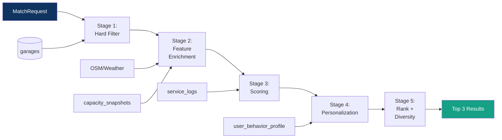
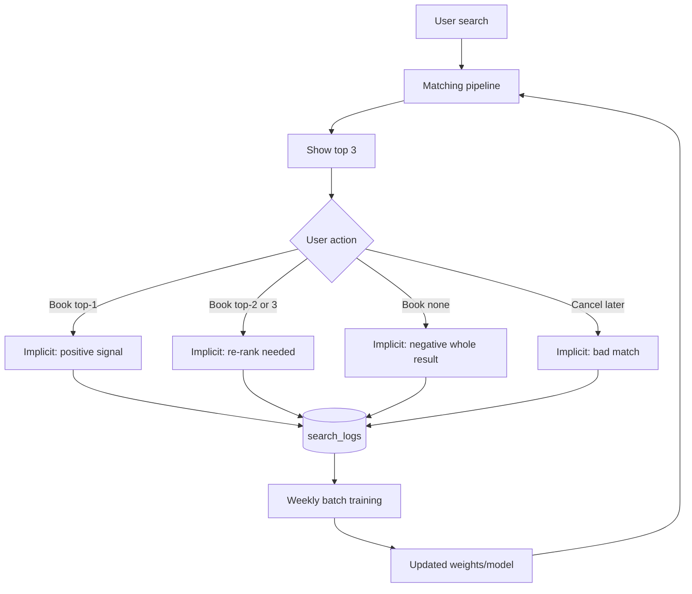
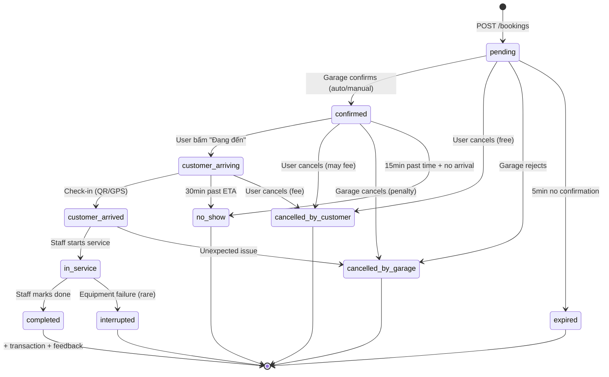

# Phase 2 — Core Operations: Smart Matching Engine & Booking System

> **Chi tiết thiết kế Phase 2 — tim của hệ thống WashMind**
> **Stack update**: FastAPI + MongoDB + **OpenStreetMap (OSRM/Nominatim)** thay GoongIO
> **Ngày tạo**: 17/04/2026
> **Ngày cập nhật**: 17/04/2026

---

## 0. Mục Tiêu & Nguyên Tắc

### 0.1. Phase 2 giải bài toán gì?

Phase 1 xong → ta có auth, tenant, garage, vehicle. Nhưng hệ thống **chưa có giá trị gì cho user**. Phase 2 là phase khi WashMind trở thành **useful**: user mở app → nhận gợi ý → đặt lịch → rửa xe.

**3 bài toán cốt lõi Phase 2 giải:**

| Bài toán | Câu hỏi business | Thành phần |
|---|---|---|
| **Matching** | "Gara nào tốt nhất cho user này, ngay lúc này?" | Smart Matching Engine |
| **Booking** | "Làm sao đặt lịch không conflict, không mất slot?" | Booking State Machine + Distributed Lock |
| **Capacity** | "Gara đang đông không? Khi user đến thì sao?" | Real-time Monitoring + Predictor |

### 0.2. Nguyên tắc thiết kế

> [!IMPORTANT]
> **Những nguyên tắc này quan trọng hơn từng chi tiết implementation. Khi phải trade-off, quay lại đây.**

1. **Predict at arrival, not at search.** Đây là điểm khác biệt cốt lõi với Google Maps. WashMind đánh giá trạng thái gara tại thời điểm **user đến nơi**, không phải thời điểm user tìm kiếm.

2. **Data moat from day 1.** Log MỌI thứ từ đầu: search query, alternatives shown, user decision, actual travel time, actual service time. Data càng nhiều → matching càng chính xác → moat càng sâu. Code copy được, data thì không.

3. **Decoupled scoring.** Mỗi scoring function độc lập, có thể calibrate/thay thế riêng. Không có 1 "big model" monolithic. Cold-start dùng rule-based, warm-start dùng ML — nhưng code path như nhau.

4. **Graceful degradation.** OSRM down? Fallback distance tính theo Haversine. Weather API down? Skip weather score. Capacity prediction chưa có đủ data? Dùng historical mean. Không bao giờ fail toàn bộ vì 1 component.

5. **Vietnam-first UX.** Traffic peak hour (17:00-19:30), mưa bất chợt mùa hè, xe Mercedes đời 2023 ở Q1 khác SUV bình dân ở Q12. Các tham số default phải fit VN, không copy mỹ.

### 0.3. Tie back to business metrics

Phase 2 MVP phải chứng minh được các metric trong [`WashMind_Business_Perspective.md`](../WashMind_Business_Perspective.md):

| Metric | Target Phase 2 | Thành phần phụ trách |
|---|---|---|
| Matching accuracy | >80% user hài lòng với top-1 | Scoring + Personalization |
| Completion rate | >90% booking → thực hiện | Booking State Machine |
| Fill rate | >20% lượt rửa tại gara đến từ WashMind | End-to-end flow |
| Retention D7 | >40% user quay lại | Personalization + proactive suggestions |

---

## 1. Stack Changes: GoongIO → OpenStreetMap

### 1.1. Tại sao chuyển sang OSM?

| Yếu tố | GoongIO | OpenStreetMap (OSRM + Nominatim) |
|---|---|---|
| **License** | Commercial, quota limits | Open Data (ODbL) — không giới hạn |
| **Chi phí** | Per-call pricing | Self-host gần như free (VPS ~$20/month) |
| **VN coverage** | Tốt cho VN | Tốt dần, cần contribute-back cho data moat |
| **Control** | Black box | Full control (tune routing profile, custom data) |
| **Data privacy** | Send user location to 3rd party | Self-hosted → data nằm trong infra của mình |
| **Unit economics** | Chi phí per query → ảnh hưởng margin | Chi phí cố định → scale không tăng |

**Quyết định**: OSM self-hosted cho matching backend, dùng OSM tiles qua Leaflet cho frontend map.

> [!NOTE]
> **Trade-off**: Cold-start self-host OSRM phức tạp hơn gọi API GoongIO. Bù lại: scale unlimited queries không lo bill, data-moat (logs traffic thực → có thể contribute-back OSM). Tasco có thể sẵn sàng support infra cho việc này.

### 1.2. Kiến trúc OSM integration

```
┌──────────────────────────────────────────────────────────────┐
│                    WashMind Backend                          │
│                                                              │
│  ┌───────────────┐     ┌─────────────┐    ┌─────────────┐  │
│  │ Matching      │────▶│ OSM Client  │───▶│  Redis      │  │
│  │ Engine        │     │ (wrapper)   │    │  Cache      │  │
│  └───────────────┘     └──────┬──────┘    │  (1h TTL)   │  │
│                               │            └─────────────┘  │
└───────────────────────────────┼──────────────────────────────┘
                                │
                ┌───────────────┼──────────────────┐
                │               │                  │
                ▼               ▼                  ▼
         ┌────────────┐  ┌────────────┐   ┌────────────────┐
         │   OSRM     │  │ Nominatim  │   │  Overpass API  │
         │ (routing)  │  │(geocoding) │   │ (nearby POIs)  │
         │ self-host  │  │ self-host  │   │  public        │
         └────────────┘  └────────────┘   └────────────────┘
              │
              ▼
         Planet.osm VN subset
         (~2GB, update weekly)
```

**Components:**

| Service | Chức năng | Deploy |
|---|---|---|
| **OSRM** | Route + ETA giữa 2 điểm, `/route/v1/driving/...` | Docker self-host, VN-only extract |
| **Nominatim** | Geocoding (address ↔ coordinates) | Docker self-host (hoặc dùng nominatim.openstreetmap.org cho MVP) |
| **Overpass API** | Tìm POIs (parking, coverage, facilities) quanh gara | Dùng public overpass-api.de (low volume) |
| **osm2pgsql + Postgres+PostGIS** | Chứa OSM data raw cho phân tích (optional) | Only for Phase 3 analytics |

### 1.3. OSM Client wrapper — abstraction

```python
# app/services/osm/osm_client.py

class OSMClient:
    """
    Wrapper quanh OSRM + Nominatim.
    Có fallback Haversine nếu OSRM fail.
    Cache kết quả trong Redis (key: origin+dest, TTL=1h).
    """
    async def get_route(
        self, origin: LatLng, destination: LatLng, 
        profile: str = "driving"
    ) -> RouteInfo:
        """
        Returns:
            duration_seconds, distance_meters, geometry (polyline),
            confidence (1.0 = OSRM, 0.5 = Haversine fallback)
        """
    
    async def get_matrix(
        self, origins: List[LatLng], destinations: List[LatLng]
    ) -> Matrix:
        """
        Batch routing — 1 request cho N điểm thay vì N requests.
        OSRM /table endpoint — cực kỳ quan trọng cho matching 
        (N=20 candidates → 1 API call thay vì 20).
        """

    async def geocode(self, address: str) -> Optional[LatLng]:
        """Address → coordinates."""

    async def reverse_geocode(self, point: LatLng) -> Optional[str]:
        """Coordinates → human-readable address."""
```

> [!IMPORTANT]
> **`get_matrix` là key performance optimization.** Với mỗi search request có 20 candidate garages, ta cần 20 routing queries. OSRM `/table` endpoint tính matrix 1x20 trong 1 request (~50ms) thay vì 20 requests tuần tự (~1s). Không implement matrix = UX chậm.

### 1.4. Weather Integration

Dùng **Open-Meteo** (open-source, no API key):
- `GET https://api.open-meteo.com/v1/forecast?latitude=...&longitude=...&current=rain,precipitation`
- Free, no quota, no signup
- 15-day forecast

Fallback: nếu weather API fail → skip `S_weather` score, tiếp tục matching.

Caching: weather theo 1 quận cache 15 phút — HCM Q1 có 50 gara đều dùng cùng weather info.

---

## 2. Smart Matching Engine — Deep Design

### 2.1. Input Schema — Đầy đủ, chi tiết

```python
# app/api/matching/matching_schemas.py

class MatchRequest(BaseModel):
    # ── USER CONTEXT ──
    user_id: Optional[str] = None                    # null for anonymous
    session_id: str                                   # track decision flow
    
    # ── LOCATION ──
    current_location: GeoPoint                        # user's current GPS
    target_location: Optional[GeoPoint] = None        # "I'll be at Q7 later"
    location_accuracy_meters: float = 50.0            # GPS accuracy hint
    
    # ── TIMING ──
    requested_time: Optional[datetime] = None         # null = ASAP
    flexibility_minutes: int = 0                      # "within ±15min"
    max_travel_minutes: int = 30                      # hard limit
    
    # ── VEHICLE ──
    vehicle_id: Optional[str] = None                  # preferred (autofill tier, history)
    vehicle_type: Optional[str] = None                # override if anonymous
    vehicle_body_type: Optional[str] = None           # sedan/suv/van — for bay size matching
    
    # ── SERVICE ──
    service_type_code: str                            # wash_basic, detailing, etc.
    service_duration_hint_minutes: Optional[int]      # user expects how long
    
    # ── PREFERENCES (explicit overrides) ──
    price_ceiling: Optional[int] = None               # VNĐ
    must_have_amenities: List[str] = []               # ["wifi", "covered"]
    preferred_brands: List[str] = []                  # chuỗi mà user trust
    excluded_garage_ids: List[str] = []               # "don't show these"
    
    # ── BEHAVIOR (optional, server-filled) ──
    # Server sẽ enrich từ user_behavior_profile nếu có user_id:
    # - distance_tolerance_km, wait_tolerance_minutes, price_sensitivity, affinities
```

```python
class MatchContext:
    """Enriched context server tự tính, không do client gửi."""
    
    # ── TEMPORAL ──
    now: datetime
    hour_of_day: int                                  # 0-23
    day_of_week: int                                  # 0=Mon
    is_weekend: bool
    is_peak_hour: bool                                # 17-19:30 Mon-Fri
    is_holiday: bool                                  # VN holidays lookup
    
    # ── WEATHER ──
    weather: WeatherSnapshot                          # precipitation, temp
    weather_forecast_next_hour: WeatherSnapshot       # at arrival time
    
    # ── TRAFFIC ──
    traffic_multiplier: float                         # 1.0=normal, 1.5=rush hour
    
    # ── USER STATE ──
    user_profile: Optional[UserBehaviorProfile]       # loaded from DB
    recent_bookings: List[BookingSummary]             # last 5 bookings for context
    
    # ── MARKET STATE ──
    area_demand: str                                  # "low", "normal", "high", "surge"
    # Derived từ search_logs gần đây cùng khu vực
```

### 2.2. Pipeline Architecture — 5 Stages



**Latency budget (p95 target):**
| Stage | Target | Nếu vượt thì sao? |
|---|---|---|
| Stage 1 (Filter) | 20ms | Geo index query + Redis — ít khi vượt |
| Stage 2 (Enrich) | 100ms | OSRM matrix + weather (cached) |
| Stage 3 (Score) | 10ms | In-memory compute |
| Stage 4 (Personalize) | 30ms | Fetch user profile, tính affinity |
| Stage 5 (Rank) | 5ms | Sort + diversity |
| **Total** | **<200ms** | UX: tìm gara như Google — thấy gần real-time |

### 2.3. Stage 1 — Hard Filter (Rule-based)

Mục đích: từ ~3,000 gara → ~20 candidates phù hợp. Nhanh, dùng MongoDB geo index.

```python
async def stage1_filter(req: MatchRequest, ctx: MatchContext) -> List[GarageCandidate]:
    """
    MongoDB query với 2dsphere + filters bắt buộc.
    Expected output: 10-30 candidates.
    """
    vehicle = await get_vehicle(req.vehicle_id) if req.vehicle_id else None
    min_tier = vehicle.minimum_garage_tier if vehicle else 1
    
    query = {
        # Geographic constraint
        "location": {
            "$nearSphere": {
                "$geometry": {"type": "Point", "coordinates": req.current_location.to_list()},
                "$maxDistance": req.max_travel_minutes * 1000,  # approx: 1min ≈ 1km urban VN
            }
        },
        # Tier constraint (hard)
        "tier": {"$gte": min_tier},
        # Status constraint
        "status": "active",
        "is_accepting_bookings": True,
        # Service availability
        "services_offered": req.service_type_code,
        # Price ceiling (join với garage_services)
        # Amenity requirements
        "amenities": {"$all": req.must_have_amenities} if req.must_have_amenities else {"$exists": True},
        # Exclusions
        "_id": {"$nin": [ObjectId(gid) for gid in req.excluded_garage_ids]},
    }
    
    # Check operating hours at requested_time (done in Python, Mongo can't easily)
    candidates = await GarageModel.collection.find(query).limit(30).to_list()
    candidates = [c for c in candidates if is_open_at(c, req.requested_time or ctx.now)]
    
    return [GarageCandidate.from_doc(c) for c in candidates]
```

**Output**: `List[GarageCandidate]` — typically 10-30 elements.

**Edge cases:**
- 0 candidates → relax: tăng `max_distance`, giảm `min_tier` by 1, thử lại. Nếu vẫn 0 → trả về empty + hint "no garage in area".
- >30 candidates → giữ top-30 by distance (MongoDB đã sort rồi).

### 2.4. Stage 2 — Feature Enrichment

Cho mỗi candidate, tính các feature cần cho scoring.

```python
async def stage2_enrich(
    candidates: List[GarageCandidate], req: MatchRequest, ctx: MatchContext
) -> List[EnrichedCandidate]:
    # 2a. Batch routing — 1 OSRM call cho all candidates
    destinations = [c.location for c in candidates]
    matrix = await osm_client.get_matrix([req.current_location], destinations)
    
    # 2b. For each candidate, predict state at arrival
    enriched = []
    for idx, c in enumerate(candidates):
        travel_sec = matrix.durations[0][idx]
        travel_min = travel_sec / 60
        arrival_time = ctx.now + timedelta(seconds=travel_sec)
        
        # Adjust by traffic multiplier (peak hour)
        travel_min *= ctx.traffic_multiplier
        
        # 2c. Predict capacity at arrival
        predicted_state = await capacity_predictor.predict(
            garage_id=c.id, at_time=arrival_time
        )
        
        # 2d. Weather at arrival
        weather_at_arrival = await weather_service.at(
            c.location, at_time=arrival_time
        )
        
        # 2e. Service-level data
        service_price = await get_garage_service_price(c.id, req.service_type_code)
        
        enriched.append(EnrichedCandidate(
            garage=c,
            travel_min=travel_min,
            travel_distance_km=matrix.distances[0][idx] / 1000,
            route_confidence=matrix.confidence,  # 1.0=OSRM, 0.5=Haversine
            arrival_time=arrival_time,
            predicted_state=predicted_state,
            weather_at_arrival=weather_at_arrival,
            service_price=service_price,
        ))
    
    return enriched
```

> [!NOTE]
> **`predicted_state`** là component phức tạp nhất. Xem [Section 5 — Capacity Prediction](#5-capacity-monitoring--prediction) cho details.

### 2.5. Stage 3 — Scoring Functions

Mỗi scoring function trả về score ∈ [0, 1]. Tổng hợp theo weighted sum.

#### 2.5.1. Distance Score `S_d`

```
S_d(c) = max(0, 1 - travel_min / T_user)

where T_user = user.distance_tolerance_minutes (default 30)
```

**Tinh chỉnh**: Penalty non-linear cho "quá xa":
```python
def score_distance(travel_min: float, user_tolerance: float) -> float:
    if travel_min <= user_tolerance * 0.5:
        return 1.0  # well within comfort
    elif travel_min <= user_tolerance:
        # linear decay 1.0 → 0.5
        return 1.0 - 0.5 * (travel_min - user_tolerance * 0.5) / (user_tolerance * 0.5)
    else:
        # steep decay 0.5 → 0
        return max(0, 0.5 * (1 - (travel_min - user_tolerance) / user_tolerance))
```

#### 2.5.2. Wait Score `S_w`

```
predicted_wait_min = predicted_queue * avg_processing_min_per_vehicle
S_w = max(0, 1 - predicted_wait_min / W_user)

where W_user = user.wait_tolerance_minutes (default 20)
```

Bonus: nếu `predicted_wait = 0` → score 1.0 (zero wait is ideal).

#### 2.5.3. Quality Score `S_q`

```
S_q = garage.tier_score / 100
```

Smooth với recency (gara vừa cải thiện score cần thời gian xây uy tín):
```python
def score_quality(garage: GarageCandidate) -> float:
    base = garage.tier_score / 100
    # Số ngày từ lần assess gần nhất
    days_since_assess = (now - garage.last_assessed_at).days
    # Confidence decay: nếu > 30 ngày chưa đánh giá, giảm weight
    confidence = max(0.5, 1 - (days_since_assess - 30) / 90) if days_since_assess > 30 else 1.0
    return base * confidence
```

#### 2.5.4. Fit Score `S_f` — Vehicle-Garage Fit

Không phải cứ tier cao là tốt. Xe Kia Morning đi vào Elite-tier detailing studio có thể bị chặt giá.

```python
def score_fit(vehicle_min_tier: int, garage_tier: int) -> float:
    delta = garage_tier - vehicle_min_tier
    # delta < 0 filtered out in stage 1
    mapping = {
        0: 1.00,   # exact match — ideal
        1: 0.85,   # slight over
        2: 0.65,   # notable over (maybe expensive)
        3: 0.45,   # way over (definitely expensive)
    }
    return mapping.get(delta, 0.3)
```

#### 2.5.5. Affinity Score `S_a` — User-Garage History

```python
def score_affinity(user_profile: UserBehaviorProfile, garage_id: str) -> float:
    for aff in user_profile.garage_affinity:
        if aff.garage_id == garage_id:
            # affinity ∈ [0, 1] based on visit_count + recency + satisfaction
            return aff.affinity
    return 0.0  # never visited

# For cold-start (no profile), return 0.0 and set w_a = 0
```

**Tinh chỉnh — exploration vs exploitation**:
- 10% traffic: ignore affinity, treat everyone as new user → giúp user discover garages mới, giúp gara mới có chance được exposure.
- Thompson sampling: occasionally boost new garages với high potential.

#### 2.5.6. Price Score `S_p`

```python
def score_price(service_price: int, user: UserBehaviorProfile, area_stats: AreaPriceStats) -> float:
    """
    - price_sensitivity='low' (user không quan tâm giá): return 0.8 constant
    - price_sensitivity='high': linear penalty so với median
    - 'medium': mid-way
    """
    if user.price_sensitivity == "low":
        return 0.8
    
    # Percentile-based: gara rẻ nhất area → 1.0, đắt nhất → 0.0
    pct = percentile_rank(service_price, area_stats.prices)
    # pct ∈ [0,1], where 0 = cheapest
    if user.price_sensitivity == "high":
        return 1.0 - pct  # steep
    else:  # medium
        return 1.0 - pct * 0.5
```

#### 2.5.7. Reliability Score `S_r`

```python
def score_reliability(garage: GarageCandidate) -> float:
    stats = garage.stats
    return (
        0.5 * stats.on_time_rate +
        0.3 * (1 - stats.complaint_rate) +
        0.2 * stats.completion_rate
    )
```

#### 2.5.8. Environment Score `S_e` — Weather + covered

```python
def score_environment(weather: WeatherSnapshot, garage: GarageCandidate) -> float:
    has_cover = "covered_bay" in garage.amenities
    if weather.precipitation_mm > 0.5:
        # Raining — strongly prefer covered
        return 1.0 if has_cover else 0.3
    elif weather.precipitation_mm > 0.1:
        # Drizzle — mildly prefer covered
        return 1.0 if has_cover else 0.7
    else:
        # Dry — neutral
        return 1.0
```

**Special case — "sau mưa" demand surge**: sau mưa lớn 30-60min, có 1 peak demand (xe bẩn). Detect bằng `weather.precipitation_mm_last_hour > 5` → context.area_demand = "surge" → trigger special weight adjustment.

#### 2.5.9. Composite Match Score

```python
def compute_match_score(
    candidate: EnrichedCandidate, user: UserBehaviorProfile, ctx: MatchContext
) -> float:
    weights = compute_context_weights(user, ctx)  # see below
    
    scores = {
        "distance":    score_distance(candidate.travel_min, user.distance_tolerance_minutes),
        "wait":        score_wait(candidate.predicted_state, user.wait_tolerance_minutes),
        "quality":     score_quality(candidate.garage),
        "fit":         score_fit(user.vehicle.min_tier, candidate.garage.tier),
        "affinity":    score_affinity(user, candidate.garage.id),
        "price":       score_price(candidate.service_price, user, ctx.area_stats),
        "reliability": score_reliability(candidate.garage),
        "environment": score_environment(candidate.weather_at_arrival, candidate.garage),
    }
    
    total = sum(weights[k] * scores[k] for k in scores)
    
    # Return also per-component scores for "why this garage" explanation
    return MatchResult(
        garage_id=candidate.garage.id,
        total_score=total * 100,  # 0-100 scale
        component_scores=scores,
        weights=weights,
        predicted_arrival=candidate.arrival_time,
        predicted_wait_minutes=candidate.predicted_state.wait_minutes,
        travel_minutes=candidate.travel_min,
    )
```

#### 2.5.10. Context-dependent Weights

```python
def compute_context_weights(user: UserBehaviorProfile, ctx: MatchContext) -> Dict[str, float]:
    # Base weights (sum = 1.0)
    w = {
        "distance": 0.22,
        "wait":     0.18,
        "quality":  0.15,
        "fit":      0.12,
        "affinity": 0.10,
        "price":    0.10,
        "reliability": 0.08,
        "environment": 0.05,
    }
    
    # ── Context adjustments ──
    
    if ctx.weather.precipitation_mm > 0.5:
        # Rain: environment matters more, distance less (willing to go further for covered)
        w["environment"] += 0.10
        w["distance"] -= 0.05
        w["wait"] -= 0.05
    
    if ctx.is_peak_hour:
        # Peak: wait time critical
        w["wait"] += 0.08
        w["distance"] -= 0.04
        w["quality"] -= 0.04
    
    if user and user.price_sensitivity == "high":
        w["price"] += 0.10
        w["quality"] -= 0.05
        w["reliability"] -= 0.05
    
    if user and not user.garage_affinity:
        # New user — redistribute affinity weight
        w["affinity"] = 0.0
        w["quality"] += 0.05
        w["reliability"] += 0.05
    
    if ctx.area_demand == "surge":
        # High demand area: promote less-popular garages for load balance
        w["wait"] += 0.08
        w["affinity"] -= 0.04
        w["quality"] -= 0.04
    
    # Normalize to sum=1 (may drift từ adjustments)
    total = sum(w.values())
    return {k: v / total for k, v in w.items()}
```

### 2.6. Stage 4 — Personalization (ML layer)

#### 2.6.1. Cold-start (Phase 2 MVP, weeks 5-6)

**Rule-based weights từ Section 2.5.10**. Đủ tốt cho pilot 5-10 gara, 100 user.

#### 2.6.2. Warm-start (Phase 2b, weeks 7-10 sau khi có data)

Khi có >1000 bookings data:

**Approach A — Learn-to-Rank (LambdaMART)**
- Features: 8 component scores + context features
- Label: user's actual choice + completion + satisfaction
- Training: pairwise preference từ search_logs (chosen vs alternatives)
- Library: LightGBM (LambdaRank objective)
- Update frequency: weekly batch

```python
# Pseudocode training
from lightgbm import LGBMRanker

X_train = features_from_search_logs()  # shape (N, num_features)
y_train = relevance_labels()            # 3=booked+rated_positive, 2=booked+ok, 1=booked+cancelled, 0=not chosen
groups = group_by_search_session()      # len = num_searches

model = LGBMRanker(
    objective="lambdarank",
    n_estimators=100, num_leaves=31,
    metric="ndcg", ndcg_at=[1, 3]
)
model.fit(X_train, y_train, group=groups)
```

**Approach B — Two-Tower Neural Network (Phase 3, scale)**

```
User Tower:                    Garage Tower:
  ├ vehicle_type_embed           ├ tier_score
  ├ district_history             ├ service_offerings
  ├ price_sensitivity            ├ amenities_embed
  ├ time_pattern                 ├ historical_performance
  └ avg_session_stats            └ capacity_profile
        ▼                                ▼
   [Dense 128]                      [Dense 128]
        ▼                                ▼
   [Dense 64]                       [Dense 64]
        ▼                                ▼
   user_emb ────────── dot ─────── garage_emb
                        ▼
                      score
```

- Training: implicit feedback from search_logs
- Serving: precompute garage embeddings offline, compute user embedding real-time, dot-product ranking
- Scale: works well to 100k users, 3000 garages

> [!IMPORTANT]
> **Phase 2 MVP KHÔNG implement NN.** Rule-based + LTR đủ cho pilot. NN là Phase 3 (intelligence) khi có data moat. Viết ở đây để thiết kế data collection compatible.

#### 2.6.3. Online Feedback Loop



### 2.7. Stage 5 — Ranking + Diversity

**Vấn đề**: nếu top-3 là 3 gara tương tự (cùng khu, cùng tier) → không cho user real choice.

**MMR (Maximal Marginal Relevance)**:
```python
def select_top_k_diverse(scored: List[MatchResult], k: int = 3, lambda_: float = 0.7) -> List[MatchResult]:
    """
    MMR balances relevance and diversity.
    lambda=1.0: pure relevance (top-3 highest scores)
    lambda=0.0: pure diversity
    lambda=0.7: good mix
    """
    selected = []
    remaining = list(scored)
    
    # Take highest score first
    remaining.sort(key=lambda r: r.total_score, reverse=True)
    selected.append(remaining.pop(0))
    
    while len(selected) < k and remaining:
        best_idx = 0
        best_mmr = float("-inf")
        for idx, cand in enumerate(remaining):
            relevance = cand.total_score
            # Similarity to already-selected (geographic + tier)
            max_sim = max(similarity(cand, s) for s in selected)
            mmr = lambda_ * relevance - (1 - lambda_) * max_sim * 100
            if mmr > best_mmr:
                best_mmr = mmr
                best_idx = idx
        selected.append(remaining.pop(best_idx))
    
    return selected

def similarity(a: MatchResult, b: MatchResult) -> float:
    """0 = very different, 1 = identical"""
    geo_sim = max(0, 1 - haversine(a.location, b.location) / 5.0)  # within 5km → similar
    tier_sim = 1.0 if a.tier == b.tier else 0.5
    return 0.7 * geo_sim + 0.3 * tier_sim
```

**"Why this garage" Explanation**:

Trả về cho mỗi result một human-readable reason:
```json
{
  "garage_id": "...",
  "total_score": 87.5,
  "reasons": [
    { "type": "best_distance", "text": "Chỉ 12 phút đi — gần nhất trong các gara phù hợp" },
    { "type": "no_wait", "text": "Hiện trống, không phải chờ" },
    { "type": "covered", "text": "Có mái che — phù hợp trời đang mưa" }
  ],
  "trade_offs": [
    { "type": "price_higher", "text": "Giá cao hơn trung bình khu vực 15%" }
  ]
}
```

Implementation: inspect `component_scores` — component có score cao (>0.8) → reason, component thấp (<0.4) → trade_off.

---

## 3. Booking System — Full State Machine

### 3.1. State Diagram



### 3.2. Concurrency — Distributed Lock

**Vấn đề**: 2 user book cùng slot cùng lúc → double-book.

**Solution**: Redis distributed lock per `(garage_id, time_slot)`.

```python
# app/services/booking/booking_service.py

async def create_booking(req: BookingCreateRequest, user: dict) -> Booking:
    # Acquire lock
    slot_key = f"slot_lock:{req.garage_id}:{req.requested_time.isoformat(timespec='minutes')}"
    async with redis_client.lock_context(slot_key, timeout=10):
        # Inside lock — check capacity still available
        garage = await get_garage(req.garage_id)
        current_state = await get_realtime_state(garage)
        
        # Predict available slots at requested_time
        predicted = await capacity_predictor.predict(garage.id, req.requested_time)
        if predicted.available_bays == 0:
            raise HTTPException(409, detail="No slot available at requested time")
        
        # Create booking (status=pending)
        booking = Booking(
            tenant_id=garage.tenant_id,
            booking_code=generate_booking_code(),
            customer_id=user["user_id"],
            garage_id=req.garage_id,
            vehicle_id=req.vehicle_id,
            service_type_code=req.service_type_code,
            price=await get_service_price(req.garage_id, req.service_type_code),
            requested_time=req.requested_time,
            estimated_arrival=req.requested_time,
            status="pending",
            timestamps={"created_at": now()},
            matching_context=req.matching_context,  # from search_logs
        )
        await booking.save()
    
    # Outside lock — send notifications
    await notify_garage(booking)       # webhook/push
    await schedule_eta_tracker(booking)
    await schedule_expiry_timer(booking, minutes=5)  # auto-expire if not confirmed
    
    return booking
```

### 3.3. ETA Tracking (Customer Journey)

Khi user bấm "Đang đến" (`customer_arriving`):

```python
async def track_customer_eta(booking_id: str):
    """
    Background task — refresh ETA every 2 minutes while customer is arriving.
    Notify garage if customer is significantly late.
    """
    while True:
        booking = await get_booking(booking_id)
        if booking.status != "customer_arriving":
            break
        
        # Get customer current location (from mobile app push)
        customer_loc = await get_latest_location(booking.customer_id)
        if not customer_loc:
            await asyncio.sleep(120)
            continue
        
        route = await osm_client.get_route(customer_loc, booking.garage.location)
        new_eta = now() + timedelta(seconds=route.duration_seconds)
        
        # Update DB
        await update_booking_field(booking_id, "estimated_arrival", new_eta)
        
        # Notify garage if significantly different from original
        minutes_late = (new_eta - booking.requested_time).total_seconds() / 60
        if minutes_late > 10:
            await notify_garage(booking, f"Customer delayed by {minutes_late:.0f} min")
        
        await asyncio.sleep(120)
```

### 3.4. Cancellation Policies

| Trạng thái lúc cancel | Customer phí | Garage phí |
|---|---|---|
| pending / 5min sau confirmed | Free | N/A |
| confirmed > 5min | 10% booking | — |
| customer_arriving | 20% booking | — |
| Garage cancels sau confirmed | Refund + 20% apology credit | Penalty điểm + không bị commission |
| no_show | 50% booking | — |

**Implementation**: `POST /bookings/{id}/cancel` → check policy dựa trên `status + time`.

### 3.5. Check-in Verification (QR vs GPS)

**2 options**:

**Option A — QR code** (preferred, anti-fraud):
- Garage có QR mounted at entrance
- Customer scan → verifies `(garage_id, booking_id)` match

**Option B — GPS fallback**:
- Check customer location within 100m of garage
- Lower confidence, could be abused

```python
async def checkin(booking_id: str, method: str, payload: dict, user: dict):
    booking = await get_booking_for_user(booking_id, user)
    if booking.status != "customer_arriving":
        raise HTTPException(400, "Booking not in arriving state")
    
    if method == "qr":
        verified = verify_qr_payload(payload, booking.garage_id)
    elif method == "gps":
        loc = GeoPoint(**payload)
        dist = haversine(loc, booking.garage.location)
        verified = dist < 100  # 100m
    else:
        raise HTTPException(400, "Invalid method")
    
    if not verified:
        raise HTTPException(400, "Check-in verification failed")
    
    await update_booking(booking_id, {
        "status": "customer_arrived",
        "timestamps.customer_arrived_at": now(),
        "matching_context.actual_travel_minutes": (
            now() - booking.timestamps.customer_departed_at
        ).total_seconds() / 60,
    })
```

---

## 4. Capacity Monitoring & Prediction

### 4.1. Real-time Tracking

**Source of truth**: Garage staff update qua app/tablet.

```
Events that trigger capacity update:
├── Customer arrived (check-in)           → waiting += 1
├── Service started                        → in_service += 1, waiting -= 1
├── Service completed                      → in_service -= 1
├── Customer cancelled (arrived but left)  → waiting -= 1
```

Mỗi event → update `garages.current_load` + insert `capacity_snapshots` row.

**Snapshotting**: `capacity_snapshots` insert mỗi 5 phút (cron) HOẶC mỗi event (whichever more frequent). Data dùng cho:
- Historical baseline (mean by hour/day)
- ML capacity prediction (Phase 3)

### 4.2. Capacity Predictor

```python
# app/services/matching/capacity_predictor.py

class CapacityPredictor:
    async def predict(self, garage_id: str, at_time: datetime) -> PredictedState:
        """
        Predict garage state at a future time.
        
        Algorithm (Phase 2 MVP):
            predicted_load = 
                0.5 * pipeline_projection(current_state, bookings, at_time) +
                0.3 * historical_baseline(garage_id, at_time.hour, at_time.weekday()) +
                0.2 * current_state_decay(current_state, minutes_ahead)
        """
        minutes_ahead = (at_time - now()).total_seconds() / 60
        
        # Component 1: Pipeline projection — most accurate short-term
        current = await get_current_load(garage_id)
        confirmed_bookings = await get_confirmed_bookings_near(
            garage_id, from_time=now(), to_time=at_time + timedelta(minutes=30)
        )
        pipeline = project_pipeline(current, confirmed_bookings, at_time)
        
        # Component 2: Historical baseline — dependable for long-term
        baseline = await self.get_historical_baseline(
            garage_id, at_time.hour, at_time.weekday()
        )
        
        # Component 3: Current state decay
        decayed = decay_state(current, minutes_ahead)
        
        # Blend weights depend on how far ahead we're predicting
        if minutes_ahead < 15:
            w = {"pipeline": 0.7, "decayed": 0.2, "baseline": 0.1}
        elif minutes_ahead < 60:
            w = {"pipeline": 0.5, "decayed": 0.1, "baseline": 0.4}
        else:
            w = {"pipeline": 0.2, "decayed": 0.0, "baseline": 0.8}
        
        vehicles_in_service = (
            w["pipeline"] * pipeline.in_service +
            w["decayed"] * decayed.in_service +
            w["baseline"] * baseline.in_service
        )
        vehicles_waiting = (
            w["pipeline"] * pipeline.waiting +
            w["decayed"] * decayed.waiting +
            w["baseline"] * baseline.waiting
        )
        
        available_bays = max(0, garage.total_bays - round(vehicles_in_service))
        wait_minutes = estimate_wait(vehicles_waiting, available_bays, avg_processing_time)
        
        return PredictedState(
            in_service=vehicles_in_service,
            waiting=vehicles_waiting,
            available_bays=available_bays,
            wait_minutes=wait_minutes,
            confidence=compute_confidence(minutes_ahead, baseline_data_points),
        )
```

### 4.3. Historical Baseline

```python
async def get_historical_baseline(garage_id: str, hour: int, dow: int) -> BaselineState:
    """
    Aggregate from capacity_snapshots to get typical load at this hour/dow.
    Last 4 weeks of data, excluding outliers.
    """
    cutoff = now() - timedelta(weeks=4)
    snapshots = await capacity_snapshots.collection.find({
        "garage_id": garage_id,
        "hour_of_day": hour,
        "day_of_week": dow,
        "timestamp": {"$gte": cutoff},
    }).to_list()
    
    if len(snapshots) < 5:
        # Not enough data — fallback to garage's avg
        return BaselineState(in_service=garage.avg_utilization * garage.total_bays, waiting=0)
    
    # Median (robust to outliers)
    in_service_median = median([s["vehicles_in_service"] for s in snapshots])
    waiting_median = median([s["vehicles_waiting"] for s in snapshots])
    return BaselineState(in_service=in_service_median, waiting=waiting_median)
```

### 4.4. ETA Calibration (Phase 2 polish)

**Vấn đề**: gara self-report "trung bình 25 phút / xe" nhưng thực tế 35 phút → user giận vì chờ lâu hơn dự đoán.

**Solution**: calibrate per garage from `service_logs`:

```python
async def update_garage_eta_calibration(garage_id: str):
    """
    Weekly job — compute actual vs estimated service time for this garage.
    Update garage.capacity.avg_processing_time_minutes.
    """
    logs = await service_logs.collection.find({
        "garage_id": garage_id,
        "created_at": {"$gte": now() - timedelta(weeks=4)},
        "outcome.completed": True,
    }).to_list()
    
    if len(logs) < 20:
        return  # insufficient
    
    actual_times = [l["timing"]["processing_time_minutes"] for l in logs]
    # Use 75th percentile as conservative estimate (UX: better under-promise)
    p75 = np.percentile(actual_times, 75)
    
    await garages.collection.update_one(
        {"_id": garage_id},
        {"$set": {"capacity.avg_processing_time_minutes": round(p75)}}
    )
```

---

## 5. Data Collection — The Data Moat

> [!IMPORTANT]
> **Mỗi search, mỗi booking, mỗi feedback — TẤT CẢ đều log từ ngày đầu.** Đây là competitive moat. Code copy được, data 6 tháng thì không.

### 5.1. Search Logs (in Phase 2, not just Phase 3)

Ban đầu tài liệu gốc đẩy `search_logs` sang Phase 3. **Sửa**: bắt đầu log từ Phase 2 MVP ngay.

Mỗi `POST /match/search` → insert 1 row vào `search_logs`:
- Context: user, location, vehicle, time, weather
- Results: top N garages shown với score breakdown
- Decision: tracked asynchronously (user book gara nào? abandon?)

### 5.2. Booking Timestamps (the ground truth)

Trong `bookings.timestamps` — lưu mọi moment. Sau này aggregate thành `service_logs`:
```
created_at        →    confirmed_at   →    customer_departed_at → 
customer_arrived_at → service_started_at → service_completed_at
```

Gap analysis:
- `arrived_at - departed_at` = actual travel time (ground truth)
- `started_at - arrived_at` = wait time
- `completed_at - started_at` = processing time

**→ Calibrate EVERY scoring function weekly from this data.**

### 5.3. Implicit Feedback Signals

| Signal | Ý nghĩa | Sử dụng |
|---|---|---|
| `selected_rank` | User click rank 1, 2, or 3 | LTR training |
| `time_spent_seconds` | Time on result list | Attention signal |
| `abandoned` | User không book ai | Negative signal cho batch |
| `booked_after_re_search` | User refresh rồi mới book | Bad first suggestion |
| `cancelled_pre_service` | Cancel trước khi rửa | Bad match signal |
| `completed + no_complaint` | Rửa xong không phản hồi | Weak positive |
| `completed + thumbs_up` | Rửa xong positive | Strong positive |
| `repeat_same_garage` | Quay lại gara đó trong 30 ngày | Very strong positive |

---

## 6. Updated MongoDB Collections (so với Phase 1 original plan)

### 6.1. Collections NEW in Phase 2

Không thay đổi từ building_plan.md Phase 2 section. Giữ nguyên: `service_types`, `garage_services`, `bookings`, `capacity_snapshots`.

**+Thêm mới** (originally Phase 3, moved to Phase 2 MVP cho data moat):
- `search_logs` — mỗi search query
- `eta_updates` — mỗi ETA refresh for live bookings (low-volume)

### 6.2. Updated `bookings` schema

Bổ sung fields vào `matching_context`:

```javascript
{
  // ... existing fields
  matching_context: {
    user_location_at_search: { type: "Point", coordinates: [...] },
    estimated_travel_minutes: 15,
    actual_travel_minutes: null,           // filled on arrival
    match_score: 87.5,
    component_scores: {                    // NEW — for analysis
      distance: 0.92, wait: 0.85, quality: 0.7, fit: 1.0,
      affinity: 0.3, price: 0.6, reliability: 0.88, environment: 1.0
    },
    weights: {                              // NEW — which weights were used
      distance: 0.22, wait: 0.18, ...
    },
    alternatives_shown: [                   // NEW — detailed, not just count
      { garage_id: ObjectId, rank: 2, score: 82.1, distance_km: 2.3 },
      { garage_id: ObjectId, rank: 3, score: 79.5, distance_km: 3.1 }
    ],
    was_top_recommendation: true,
    search_log_id: ObjectId,                // NEW — link to search_logs
    context_snapshot: {                     // NEW — weather, traffic, demand
      weather: { precipitation_mm: 0, condition: "clear" },
      traffic_multiplier: 1.15,
      is_peak_hour: true,
      area_demand: "normal"
    }
  }
}
```

### 6.3. Indexes critical cho Phase 2

```javascript
// garages — already 2dsphere, add compound for filters
{ "tier": 1, "status": 1, "is_accepting_bookings": 1, "services_offered": 1 }

// bookings — for matching pipeline (get confirmed bookings near time)
{ "garage_id": 1, "status": 1, "requested_time": 1 }

// capacity_snapshots — for historical baseline
{ "garage_id": 1, "hour_of_day": 1, "day_of_week": 1 }

// search_logs — for LTR training data
{ "created_at": -1 }
{ "customer_id": 1, "created_at": -1 }
```

---

## 7. API Endpoints — Phase 2 Updated

### 7.1. Matching endpoints

| Method | Path | Permission | Mô tả |
|---|---|---|---|
| `POST` | `/match/search` | customer / public | Full Smart Matching pipeline (with explanation) |
| `POST` | `/match/refresh` | customer | Re-rank existing search with updated real-time state |
| `POST` | `/match/feedback` | customer | Submit implicit feedback ("this match was good/bad") |
| `GET` | `/garages/nearby` | public | Simple geo-query, no scoring (for map browsing) |

### 7.2. Booking endpoints

| Method | Path | Permission | Mô tả |
|---|---|---|---|
| `POST` | `/bookings` | customer | Create booking (with distributed lock) |
| `GET` | `/bookings` | auth | List bookings (role-filtered) |
| `GET` | `/bookings/{id}` | auth | Detail |
| `POST` | `/bookings/{id}/confirm` | garage | Garage confirms pending booking |
| `POST` | `/bookings/{id}/depart` | customer | "Tôi đang đi" — start ETA tracking |
| `POST` | `/bookings/{id}/checkin` | customer | Check-in via QR/GPS |
| `POST` | `/bookings/{id}/start-service` | garage | Staff starts service |
| `POST` | `/bookings/{id}/complete` | garage | Service done |
| `POST` | `/bookings/{id}/cancel` | customer/garage | Cancel with reason |
| `POST` | `/bookings/{id}/feedback` | customer | Rating + optional comment |

### 7.3. Capacity endpoints

| Method | Path | Permission | Mô tả |
|---|---|---|---|
| `GET` | `/garages/{id}/capacity` | public | Current + predicted (next 2h) |
| `POST` | `/garages/{id}/capacity/update` | staff | Manual update by garage staff |
| `GET` | `/garages/{id}/capacity/history` | garage:view | Past 7 days snapshots |

### 7.4. Service catalog

| Method | Path | Permission | Mô tả |
|---|---|---|---|
| `GET` | `/service-types` | public | Platform catalog |
| `GET` | `/garages/{id}/services` | public | Services offered + prices |
| `POST` | `/garages/{id}/services` | garage:edit | Add service |
| `PUT` | `/garages/{id}/services/{code}` | garage:edit | Update price/duration |

### 7.5. Example: `POST /match/search`

**Request:**
```json
{
  "current_location": { "lat": 10.7834, "lng": 106.6856 },
  "requested_time": "2026-04-17T18:30:00+07:00",
  "service_type_code": "wash_premium",
  "vehicle_id": "507f1f77bcf86cd799439020",
  "max_travel_minutes": 25,
  "must_have_amenities": ["covered_bay"]
}
```

**Response:**
```json
{
  "status": "ok",
  "data": {
    "search_id": "69e26...",
    "results_count": 3,
    "matches": [
      {
        "garage_id": "...",
        "name": "AutoSpa Pro Q3",
        "total_score": 89.3,
        "rank": 1,
        "travel_minutes": 12,
        "travel_distance_km": 2.8,
        "predicted_arrival": "2026-04-17T18:42:00+07:00",
        "predicted_wait_minutes": 5,
        "service_price": 180000,
        "tier": 3,
        "reasons": [
          { "type": "best_distance", "text": "Chỉ 12 phút — gần nhất" },
          { "type": "low_wait", "text": "Chỉ chờ 5 phút khi đến" },
          { "type": "covered", "text": "Có mái che (trời mưa)" }
        ],
        "trade_offs": []
      },
      { "...": "rank 2" },
      { "...": "rank 3" }
    ],
    "context": {
      "weather": "raining",
      "is_peak_hour": true,
      "area_demand": "normal"
    }
  }
}
```

---

## 8. Background Workers — New in Phase 2

```
app/services/
├── matching/
│   ├── matching_engine.py          # Main pipeline
│   ├── capacity_predictor.py       # Used by matching_engine
│   ├── scoring_functions.py        # 8 score functions
│   └── osm_client.py
├── booking/
│   ├── booking_service.py          # CRUD with lock
│   ├── eta_tracker_worker.py       # Background task per active booking
│   └── expiry_worker.py            # Auto-expire pending bookings
├── capacity/
│   ├── snapshot_worker.py          # Cron: every 5min snapshot all active garages
│   └── calibrator_worker.py        # Weekly: update avg_processing_time_minutes
└── weather/
    └── weather_service.py          # Cached wrapper around Open-Meteo
```

**Worker responsibilities:**

| Worker | Schedule | Mô tả |
|---|---|---|
| `snapshot_worker` | Every 5 minutes | Snapshot `current_load` of all active garages → `capacity_snapshots` |
| `calibrator_worker` | Weekly Sunday 02:00 | Recompute `avg_processing_time_minutes` per garage from service_logs |
| `eta_tracker_worker` | Per-booking (spawned on `depart`) | Poll customer location, refresh ETA, notify garage |
| `expiry_worker` | Per-booking (spawned on create) | Cancel if not confirmed within 5min |
| `baseline_worker` | Daily 03:00 | Pre-compute historical baselines into Redis cache |

---

## 9. Testing Strategy

### 9.1. Unit tests (scoring functions)

```python
# test/test_matching_scoring.py
def test_score_distance_well_within():
    assert score_distance(5, user_tolerance=30) == 1.0

def test_score_fit_exact_match():
    assert score_fit(vehicle_min_tier=3, garage_tier=3) == 1.0

def test_score_environment_rain_no_cover():
    weather = WeatherSnapshot(precipitation_mm=2.0)
    garage = GarageCandidate(amenities=["wifi"])  # no covered
    assert score_environment(weather, garage) == 0.3
```

### 9.2. Integration tests (full pipeline)

Mock OSM + weather. Seed 5 garages. Test:
- Garage owner search → empty (not authorized?)
- Customer search premium service → only tier>=2 shown
- Rain context → covered garages ranked higher
- Peak hour → wait time weighted more

### 9.3. Load tests

- 100 concurrent searches → p95 latency < 300ms
- 50 concurrent bookings on same slot → only 1 succeeds (lock works)

### 9.4. Shadow mode testing (pre-prod)

Deploy matching in **shadow mode** on live traffic:
- Log result WITHOUT showing to user
- Compare with production (if any) or just analyze patterns
- Run 1 week before making it live

---

## 10. Phase 2 Build Order & Week Plan

Align với Wash3000 timeline (weeks 5-6 = MVP, weeks 7-10 = refine):

### Week 5 — Foundation + Happy Path

| Day | Task | Deliverable |
|---|---|---|
| D1 | Setup OSM (OSRM Docker, VN extract) | `osm_client.get_route` works |
| D2 | Setup Open-Meteo + Redis caching | Weather for HCM coords, cached |
| D3 | `service_types` + `garage_services` models + seed | Can list services per garage |
| D4 | `bookings` model + CRUD (no lock yet) | Can create booking via API |
| D5 | State machine + transitions | Booking can go pending→completed |

### Week 6 — Matching Engine MVP

| Day | Task | Deliverable |
|---|---|---|
| D1 | Stage 1 hard filter + geo query | `/match/search` returns 5-20 candidates |
| D2 | Stage 2 enrichment (OSM matrix, weather) | Enriched candidates with full context |
| D3 | Stage 3 all 8 scoring functions + tests | Math correct, unit tests green |
| D4 | Stage 5 MMR diversity + "reasons" generation | Response schema complete |
| D5 | Distributed lock + capacity check on booking | No double-book possible |

### Week 7 — Capacity & Tracking

| Day | Task | Deliverable |
|---|---|---|
| D1 | `capacity_snapshots` + `snapshot_worker` cron | Snapshots every 5min |
| D2 | `CapacityPredictor` with historical baseline | Predict returns reasonable values |
| D3 | Pipeline projection from confirmed bookings | Predict uses real bookings |
| D4 | `eta_tracker_worker` for customer journey | Garage gets ETA updates |
| D5 | Integration tests end-to-end | Book → depart → checkin → complete |

### Week 8 — Data Collection + Polish

| Day | Task | Deliverable |
|---|---|---|
| D1 | `search_logs` collection + full logging | Every search recorded with full context |
| D2 | Feedback endpoints + implicit signals | Thumbs up/down + tracking abandonment |
| D3 | "Why this garage" explanations | UX clarity |
| D4 | Expose `/match/refresh` for re-ranking | User sees up-to-date wait times |
| D5 | Admin dashboard cho analytics (basic) | Can see # searches, match scores, conversions |

### Week 9-10 — Refine based on pilot data

- Calibrate weights based on actual user choices (LambdaMART warm-start)
- Fix capacity predictor based on actual vs predicted divergence
- Tune scoring for edge cases (rain, peak, new garages)
- A/B test exploration % (10% discovery mode)

---

## 11. Risks & Mitigations

| Risk | Probability | Impact | Mitigation |
|---|---|---|---|
| **OSRM performance không đủ cho matrix query** | Med | High | Pre-cache top routes between hot areas in Redis. Upgrade to sharded OSRM if needed. |
| **Capacity data thiếu (gara không update real-time)** | High | High | Incentive: garage dashboard shows "your response rate vs peers". Auto-mark "stale" nếu >2h không update → matching dùng baseline thay current. |
| **Cold-start: first 100 users không có profile** | High | Med | Use default weights. Collect data aggressively. Show "new here? here's our recommendation" UX. |
| **Double-booking bug** | Low | High | Redis lock + Mongo capacity check inside transaction. Load test scenario 50 concurrent. |
| **ETA inaccurate (GPS drift, traffic)** | High | Med | Show range "12-15 phút" thay vì số cố định. Track actual vs predicted, weekly calibrate multiplier. |
| **User game the system (cancel right before no-show)** | Low | Low | Cancellation policy. Track `cancellation_rate` in user profile. After >30% → low affinity boost for that user. |
| **Gara gian lận check-in (mark arrived nhưng không rửa)** | Med | Med | Phase 2 MVP: trust-based. Phase 3: camera integration / customer confirmation required. |
| **Matching "hunting": user book, cancel, rebook cheaper** | Low | Low | Rate limit searches per user. Cancellation fee deters abuse. |

---

## 12. Success Criteria — How We Know Phase 2 "Works"

### 12.1. Technical KPIs

- [ ] p95 `/match/search` latency < 300ms
- [ ] p95 `/bookings` (create) latency < 500ms
- [ ] 0 double-bookings in 1 week of load testing
- [ ] Capacity prediction error < 30% (predicted vs actual wait)
- [ ] OSRM uptime > 99.5%

### 12.2. Product KPIs (aligned with business doc)

- [ ] 80% user rate top-1 match as "good fit" (thumbs up)
- [ ] 90% booking → completed (no_show rate < 10%)
- [ ] 20% of partnered garages' service volume comes from WashMind
- [ ] Re-search rate < 20% (mean: first result was good enough)

### 12.3. Data Moat KPIs

- [ ] 100% searches logged with full context
- [ ] 100% bookings have complete timestamp trail
- [ ] 95% completed bookings have feedback (explicit or implicit)

---

## 13. Phase 2 → Phase 3 Handoff

**What Phase 2 produces that Phase 3 needs:**

1. **service_logs** (rich data on every service) → training data for ML
2. **search_logs** (every context, every decision) → LTR training
3. **capacity_snapshots** (time-series) → capacity prediction model
4. **user_behavior_profile** (aggregated) → personalization features
5. **ETA calibration history** → improve routing confidence

**What Phase 3 builds on top:**

- Replace rule-based weights → LightGBM LambdaRank
- Replace historical baseline → Gradient Boosting capacity prediction
- Add Two-Tower NN for user-garage embeddings (scale phase)
- Demand forecasting (proactive suggestions in off-peak)

---

## Appendix A — Formulas Summary

```
MatchScore(user, garage, ctx) = Σ w_i · S_i(...)

S_distance(travel_min, T_user):
    if travel_min ≤ T_user/2:  return 1.0
    if travel_min ≤ T_user:    return 1 - 0.5·(travel_min - T_user/2)/(T_user/2)
    else:                      return max(0, 0.5·(1 - (travel_min - T_user)/T_user))

S_wait(predicted_wait, W_user):
    return max(0, 1 - predicted_wait / W_user)

S_quality(garage):
    return (garage.tier_score / 100) · recency_confidence

S_fit(v_tier, g_tier):
    Δ = g_tier - v_tier
    return [1.0, 0.85, 0.65, 0.45][min(Δ, 3)]   # Δ<0 filtered earlier

S_affinity(user, garage):
    return affinity if garage in user.garage_affinity else 0

S_price(price, user, area):
    pct = percentile_rank(price, area.prices)
    if user.price_sensitivity == "high": return 1 - pct
    if user.price_sensitivity == "low":  return 0.8
    else:                                return 1 - 0.5·pct

S_reliability(garage):
    return 0.5·on_time_rate + 0.3·(1 - complaint_rate) + 0.2·completion_rate

S_environment(weather, garage):
    if raining:    return 1.0 if covered else 0.3
    if drizzle:    return 1.0 if covered else 0.7
    else:          return 1.0
```

## Appendix B — Weight Table (Baseline)

| Context | w_d | w_w | w_q | w_f | w_a | w_p | w_r | w_e |
|---|---|---|---|---|---|---|---|---|
| **Default** | 0.22 | 0.18 | 0.15 | 0.12 | 0.10 | 0.10 | 0.08 | 0.05 |
| **Raining** | 0.17 | 0.13 | 0.15 | 0.12 | 0.10 | 0.10 | 0.08 | 0.15 |
| **Peak hour** | 0.18 | 0.26 | 0.11 | 0.12 | 0.10 | 0.10 | 0.08 | 0.05 |
| **Price-sensitive user** | 0.22 | 0.18 | 0.10 | 0.12 | 0.10 | 0.20 | 0.03 | 0.05 |
| **New user (no affinity)** | 0.25 | 0.20 | 0.17 | 0.13 | 0.00 | 0.10 | 0.10 | 0.05 |
| **Surge demand** | 0.18 | 0.26 | 0.11 | 0.12 | 0.06 | 0.10 | 0.12 | 0.05 |

All rows sum to 1.0.

---

> **Phase 2 không phải là "thêm vài endpoint". Đây là phase khi WashMind có giá trị thật.**
> **Matching Engine = trái tim. Data moat = bất khả sao chép. Good UX = retention.**
