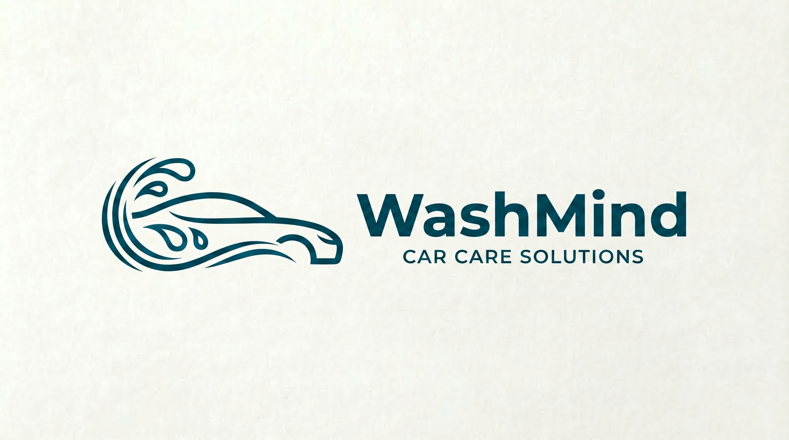
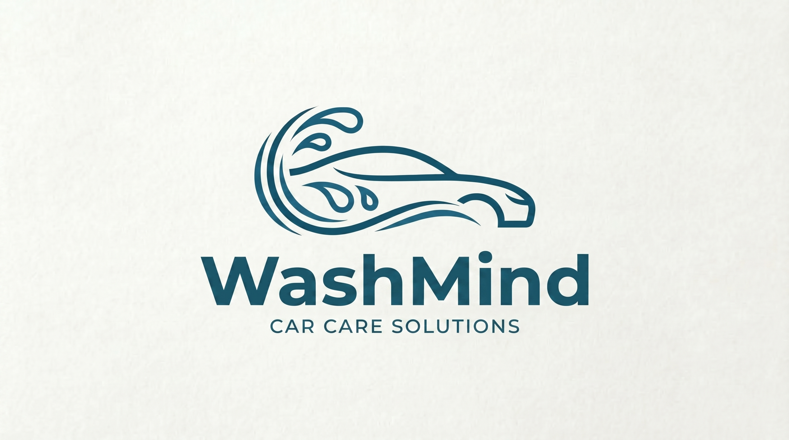

 

# **Hệ thống điều phối thông minh cho mạng lưới dịch vụ chăm sóc xe Việt Nam**

Đúng nơi · Đúng lúc · Đúng chuẩn

 

 

## Về WashMind

Thị trường rửa xe Việt Nam có hàng chục ngàn điểm dịch vụ — phân mảnh, không kết nối, không có chuẩn chất lượng chung. Người dùng tìm gara bằng cách mở Google Maps hoặc hỏi người quen, không biết gara nào phù hợp loại xe mình, không biết phải chờ bao lâu, và chỉ biết chất lượng thật sau khi đã trả tiền.

**WashMind giải quyết bài toán đó.**

WashMind là lớp thông minh *(Intelligence Layer)* nằm giữa người dùng và mạng lưới 3,000 điểm rửa xe của Tasco. Thay vì trả về một danh sách để tự chọn, WashMind **ra quyết định hộ người dùng** — gara nào phù hợp nhất với loại xe của bạn, gần nhất theo giao thông thực, và sẵn sàng phục vụ khi bạn đến nơi, không phải khi bạn bấm tìm.

 

## Điều gì khác biệt?

**Matching thông minh** — Một gara đang "full" lúc 6h30, nhưng bạn mất 25 phút để đến. Khi bạn tới, gara đã rảnh. WashMind biết điều đó, Google Maps thì không. Hệ thống tính toán trạng thái gara tại **thời điểm bạn đến**, không phải thời điểm bạn tìm kiếm.

**Phân cấp gara** — Không phải gara nào cũng giống nhau. WashMind đánh giá và phân cấp gara theo năng lực thực tế: thiết bị, quy trình, nhân sự. Xe sang được đưa vào gara đủ tiêu chuẩn. Xe phổ thông không phải trả giá premium. Đúng xe, đúng gara.

**Tin cậy bằng dữ liệu** — Thay vì rating 5 sao dễ bị thao túng, WashMind đo chất lượng bằng dữ liệu vận hành: thời gian xử lý thực tế, tỷ lệ khách quay lại, mức độ ổn định qua thời gian. Score tự cập nhật liên tục — gara tốt lên thì tăng hạng, gara xuống chất lượng thì bị cảnh báo.

 

## Tích hợp hạ tầng Tasco

WashMind được xây dựng trên nền tảng hạ tầng mà Tasco cung cấp — đây là lợi thế cạnh tranh không thể sao chép:

| Hạ tầng | Vai trò trong WashMind |
|---|---|
| **VETC** — 4M+ người dùng | Nguồn khách hàng sẵn có, nhận diện xe tự động, thanh toán liền mạch |
| **GoongIO Maps API** | Routing và ETA chính xác theo giao thông thực — input cốt lõi cho Matching Engine |
| **Tasco Payment APIs** | Thanh toán, subscription, loyalty cross-pollination với hệ sinh thái VETC |

 

## Tài liệu

| | Tài liệu | Nội dung |
|:---:|---|---|
| 01 | [Project Document](.docs/WashMind_Project_Document_v1.md) | Tổng thể dự án — bài toán, giải pháp, kiến trúc, tính năng, thuật toán, MVP, lộ trình 12 tuần |
| 02 | [Data Moat Strategy](.docs/WashMind_Data_Moat_Strategy.md) | Chiến lược dữ liệu độc quyền — 5 lớp data, cơ chế thu thập, Data Flywheel |
| 03 | [Business Strategy](.docs/WashMind_Business_Strategy.md) | Mô hình kinh doanh — 8 nguồn doanh thu, lock-in, network effects, ROI |
| 04 | [Business Perspective](.docs/WashMind_Business_Perspective.md) | Góc nhìn nhà đầu tư — Unit Economics, Go-to-Market, metrics, risk assessment |

 

## Founding Team

| Thành viên | Vai trò | Phụ trách | Liên hệ |
|---|---|---|---|
| **Nguyễn Dương** | AI Engineer · Co-Founder | Product Manager, Matching Engine, Intelligence Layer | duongnguyen4823@gmail.com |
| **Đào Trung Tín** | Software Engineer · Co-Founder | Backend, Frontend, Infrastructure | tindao2310@gmail.com |
| **Dương Hiển Kiệt** | UI/UX Designer · Co-Founder | Product Design, Brand Identity | — |

 

---

 

**WashMind** · Car Care Solutions

*Đề xuất tham gia chương trình Tasco Foundry: Wash3000*

© 2026 WashMind Team

